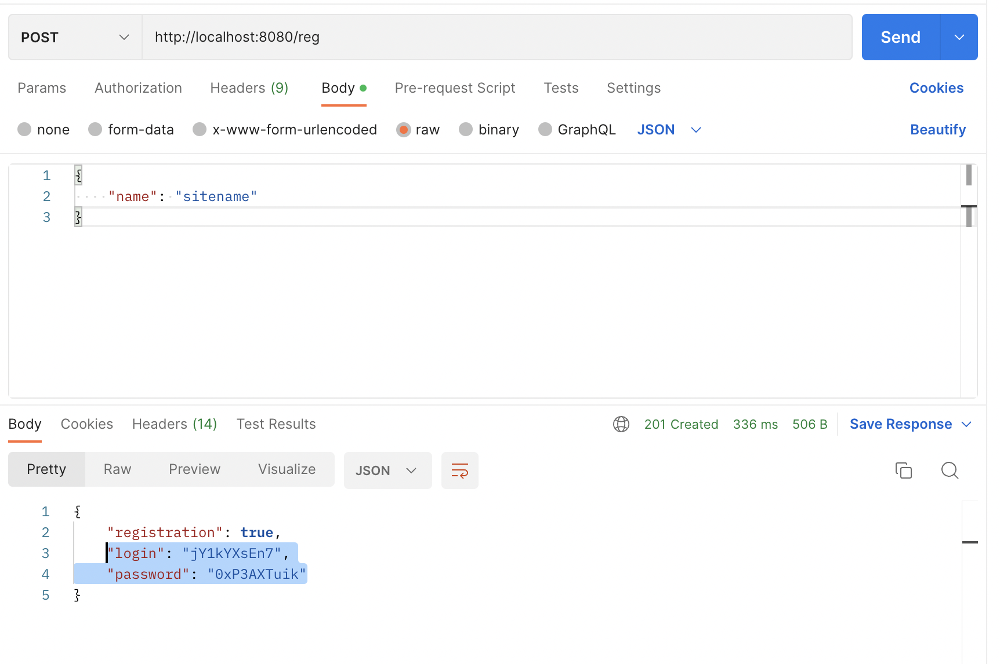

# Проект "UrlShortCut"

## О проекте

Сервис для управления безопасности URL-адресов. Cсылка передается на обработку сервису, который ее сохраняет у себя в базе данных и присваивает ей код, который служит новым адресом (при клике на него, пользователь автоматически направляется на обычный (длинный) адрес).

## Стек технологий

- **Сборка приложения в Maven 3.8**
- **Java 17**
- **Spring Boot 2.7.3**
- **Spring Data JPA 2.7.3**
- **Spring Security 2.7.3**
- **Lombok 1.18.22**
- **JSON Web Token**

## Требования к окружению

 - **Java 17**
 - **Maven 3.8**
 - **PostgresSQL 14**

## Запуск проекта

- **Создать БД**
``` shell 
create database url_shortcut;
```
- **Запустить проект по команде**
``` shell 
mvn spring-boot:run
```

## Взаимодействие с приложением

Сервисом могут пользоваться разные сайты. Каждому сайту выдается пара пароль и логин.
Чтобы зарегистрировать сайт в систему нужно отправить запрос:
``` shell 
POST /registration
```



Авторизация сделана через JWT. Пользователь отправляет POST запрос с login и password и получает ключ.
Этот ключ отправляет в запросе в блоке HEAD.

``` shell 
POST /login
```


Поcле того, как пользователь зарегистрировал свой сайт он может отправлять на сайт ссылки и получать преобразованные ссылки. И получает укороченную ссылку.

``` shell 
POST /convert
```


Когда сайт отправляет ссылку с кодом в ответ возвращается ассоциированный адрес и статус 302.

``` shell 
GET /redirect/unique_code
```


В сервисе считается количество вызовов каждого адреса. По сайту можно получить статистку всех адресов и количество вызовов этого адреса.

``` shell 
GET /statistic
```


## Контакты

- liana.timirgazina@yandex.ru
- <a href="https://t.me/mymomsaysimcool/" target="_blank">Телеграм</a></h1>
   